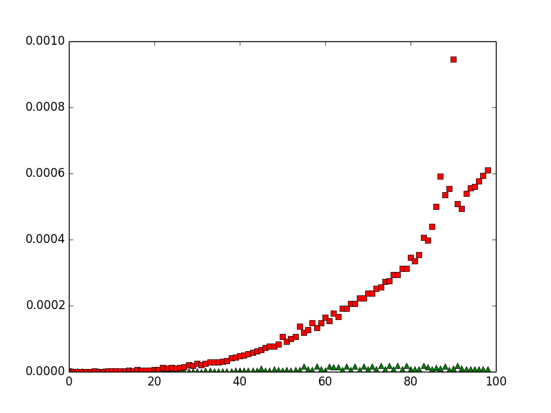

# AlgorithmsEx

This repo is used to keep the exercise codes for "Introduction to algorithms (Thrid edition)"

### About the Project build tools:
1. __CodeBlock__ as the IDE
2. Run on __Ubuntu 14.04 LTS__
3. Build with __GCC__

Or

### GNU Make
1. make, please refer to make file
2. Build with __GCC__

### Unit Test
    
    make unit
    
### Run benchmark

    make benchmark
    
This command will show you the performance comparation for solving the `Find the maximum summary in an array problem`.

* Y-axis - The time spent to solve the problem
* X-axis - The no of elements in the array (Problem size: N)
* red circle - The time consumption for find the max sum using `Exhaustive Search` algorithm.
* green triangle - The time consumption for finding the max sum using `Divide and Conquer` algorithm.
